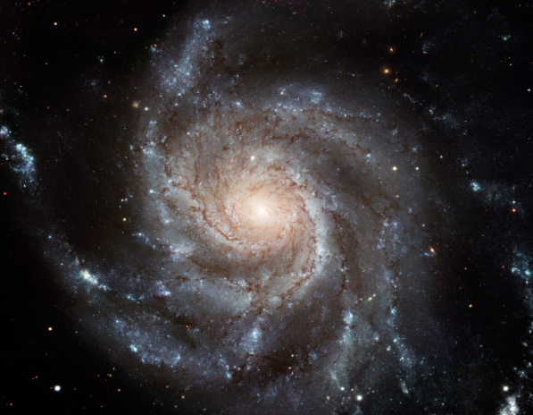

<html>

<meta name="viewport" content="width=device-width, initial-scale=1">
<meta charset="utf-8">
<link rel="stylesheet" href="main.css">

<!--This set of scripts is equivalent to including libraries.-->

<title>Spectra & Redshift Demonstration</title>

<body onload="init();">
    

    <h2 style="text-align: center;">Elemental Spectra and Redshift Demonstration</h2>
    <h4 style="text-align: center;">[λf = c]</h4>
    

    
<canvas id="myCanvas" width="1500" height="150" style="border:1px solid #000000;">
            Your browser does not support the HTML5 canvas tag.
        </canvas>
        <form id="myForm">
            <left>
                
                
Wavelength (nanometers)

                
<input type=update value="Plot Element" onclick="plotElement()">
                    <select id="elementSelect" oninput="plotElement()">...Select...</select>
                    <input type="checkbox" name="showSpectra" value="isChecked" onclick="switchState()"> Show absorption
                    spectra&nbsp;&nbsp;<input type="checkbox" name="showExtinction" value="isChecked"
                        onclick="switchGradient()" checked> Show extinction
                    &nbsp;|&nbsp;
                    <select id="lineWidth" oninput="update()">
                        <option value="1">1px</option>
                        <option value="2">2px</option>
                        <option value="3" selected>3px</option>
                        <option value="4">4px</option>
                    </select>
                    Line Width
                

                
<input type=update value="Plot Wavelength" onclick="plotSample()">&nbsp<input type=text value="520"
                        id="wav">

            </left>
            

                
Red Shift (z = ) :: Velocity of Light
                        Source Relative to You:&nbsp;&nbsp;Stationary

                <input type="range" min="-11000" max="11000" value="0" class="slider" id="shiftSlider"><input type=text value="0.000" id="zShift">
                &nbsp;&nbsp;<input type="button" name="zero" value="Zero out Redshift" onclick="zeroOut()"
                        style="position: relative;">&nbsp;&nbsp;|
                &nbsp;&nbsp;<select id="knownObjects" style="width: 200px;">...Select Object...</select>
                    Galaxy with Known Redshift
                &nbsp;&nbsp;|&nbsp;&nbsp;<input type="checkbox" id="showShift" onclick="update()">
                Show Unshifted
                
            

            <!--
<input type="update" value="Update M101 Image" onclick="draw()">
            
-->
            

            

            
Spectral Lines Source: <a href="https://www.nist.gov/"
                    id="credits">https://www.nist.gov/</a>

            
Redshift Object Info: <a href="https://stellarium-web.org/"
                    id="objectReference">Stellarium</a>

            
Velocities are determined using Flat-Time Relativistic Doppler w/o Lorentz
            

            <!--
Simulated Selected Redshift on M101, The Pinwheel Galaxy

                            This is a temporary place for a redshift simulation on pixel data for a galaxy
            <canvas id="simulation" width="600" height="469"></canvas>-->
        </form>

    

    
</body>

</html>